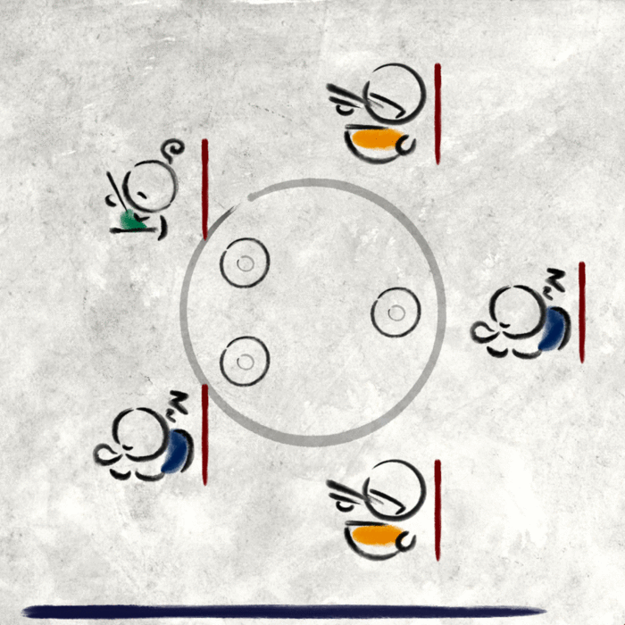

# Dining_Philisophers

The dining philosophers problem is an example problem often used in concurrent algorithm design to illustrate synchronization issues and techniques for resolving them.

## General setting

* There are N philisophers sitting around a round table
* There is a single chopstick between each pair of adjecent philisophers
* Philisophers can EAT, SLEEP and THINK, while not eating, they lose one HP per second:

  **-eat:** takes time EAT_T to complete and requires holding both (left and right) chopsticks
  
  **-sleep:** takes time SLEEP_T and holds no chopsticks, required after eating
  
  **-think:** they drift into deep contemplation about life and the universe when they hold exactly one chopstick, thinking is not required in the life of a philisopher =)

* Philisophers die when their HP drops down to 0 (including 0)
* The goal is to keep all philisophers alive for a set time MAX_TIME (or indefinitely if MAX_TIME is set to 0)
* Philisophers cannot communicate to each other or inspect the state of other philisophers

## Demo

* They can live stablely with MAXLIFE = 7, EAT_T = 2 and SLEEP_T = 1

* They die with MAXLIFE = 7, EAT_T = 5 and SLEEP_T = 2 (one needs MAX_LIFE at leat 12 for that, more to compensate threads does not running at the same speed)

## Implementation

* Each philisopher is represented by one thread
* Each chopstick is represented by a mutex lock
* Macros for MAX_LIFE, MAX_TIME, EAT_T, SLEEP_T and THINK_T
* Adjustable number of philisophers NUM_PHIL
* GUI and a version of watch-dog timer lives outside of the threads
* Screen freeze when at least one philisopher is dead

## Performance

* We used the original Dijkstrs's solution for dead-lock pervension. i.e. assging an partial order (in this case simple linear order works) to the resources (chopsticks) and require each philisopher to pick up lower numbered resources before attempting to pick up the other one.
* We randomized the starting order for an unbiased start setting
* Overall, with good starting conditions, this implementation can reach stable state for conditions close to theoritical optimal (for odd number of philisophers, the minimal MAX_LIFE one can hope to achieve needs to be at least 2 * EAT_T + SLEEP_T since at least one adjecent couple would not be eating at any given time)

## Visual Features

* Table size changes according to NUM_PHIL
* Idle chopsticks and bowls are displayed on the table
* Life bar displayed beside each philisopher
* Time bar at bottom of diaplay
* All graphic assets are produced in-house
